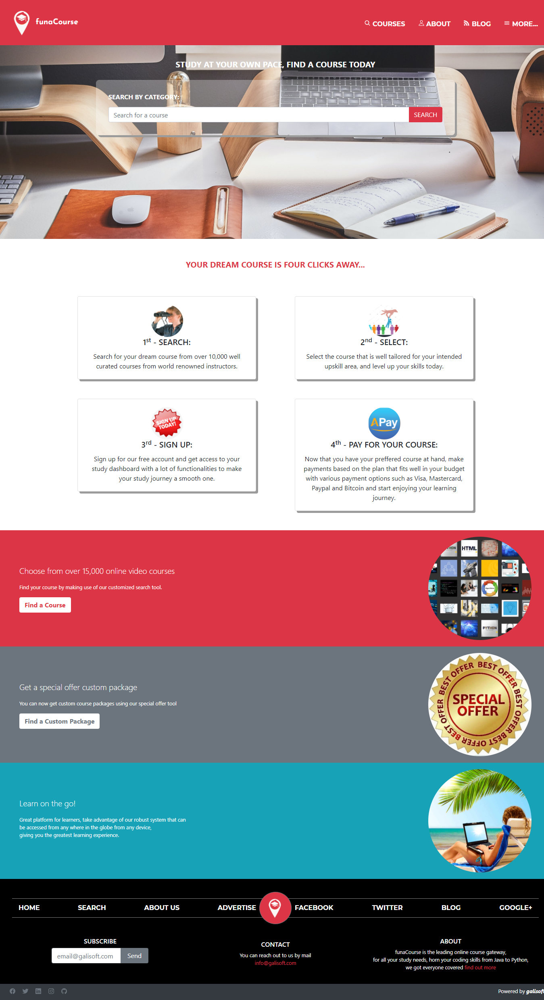

# funaCourse
funaCourse is a HTML&CSS Capstone project undertaken to fullfil the requirements of the Microverse Full Stack Web Developer program.
funCourse is web system that acts as a gateway for finding an online coding course with a lot of ease.

This project is base on the original design of 'PATASHULE' by Mathew Njuguna on Behance, thank you Mathew for the elegant design and for giving me the opportunity to up my design skills by replicating what you already designed.

## Below are screenshots of the completed pages for mobile, tablet and desktop screen sizes

## Built With

- HTML
- CSS
- Bootstrap
- ionic icons
- google fonts

## Below is the Live link to Heatmap of the Smashing Magazine home page

[Heatmap of Smashing Magazine home page Link](https://gango-anan.github.io/funaCourse/)

## Getting Started
- Install a web browser of your choice prefferably Google chrome or mozilla firefox.
- Launch your webserver and
- Copy the project files to the webserver folder
- Open your browser and launch the index.html file
- You can now search for your desired course using the search utility on the main page, just type in the course name and click on the search button.
- You will be redirected to another page with your search results, choose the appropriate course and in case you want to find out more about that particular course you can click on the 'more details' button from the window of the course you have selected.
- when you are satified with the choice of course you have made, if you are a new user you can now sign up for a free account
- Use the free account you have created to make payments for your favorite course and the course will be instantly delivered to your dash board upon receipt of payment.
- You can now start enjoying your studies.
- Thanks.

## Authors
👨🏻‍💻 **Galiwango Ananiya**
- GitHub: [@gango-anan](https://github.com/gango-anan)
- Twitter: [@gango_anan](https://twitter.com/gango_anan)
- LinkedIn: [@galiwango-ananiya](https://www.linkedin.com/public-profile/settings?trk=d_flagship3_profile_self_view_public_profile)

## 🤝 Contributing

Contributions, issues, and feature requests are welcome!

Feel free to check the [issues page](https://gango-anan.github.io/funaCourse/issues).

## Show your support

Give a ⭐️ if you like this project!

## Acknowledgments

- To make this project a success a lot of sources were used especially google, youtube, css trick website, MDN reference and above all the positive reviews from my standup team, I would like to thank all those who authored the articles I used and a big thank you to my stand up team.

## 📝 License

This project is [MIT](https://github.com/gango-anan/funaCourse/blob/master/LICENSE) licensed.

