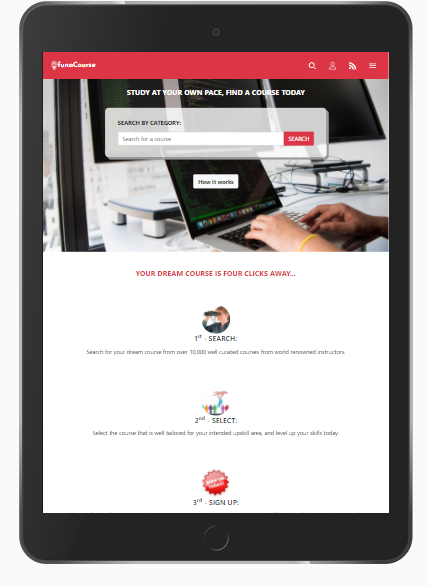
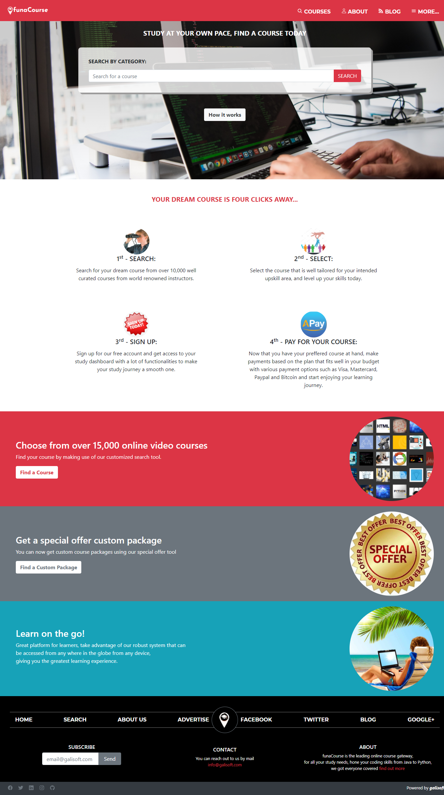

# funaCourse
funaCourse is a HTML&CSS Capstone project undertaken to fulfill the requirements of the Microverse Full Stack Web Developer program. The word 'funa' is derived from my native language which loosely translates to "find". funaCourse is a web system that acts as a gateway for finding an online coding course with a lot of ease

This project is base on the original design of 'PATASHULE' by Mathew Njuguna on Behance(https://www.behance.net/gallery/25563385/PatashuleKE). I would thank Mathew for the elegant design and for giving me the opportunity to up my design skills by replicating what you already designed.

## Below are screenshots of the completed pages for mobile, tablet and desktop screen sizes

## Built With

- HTML
- CSS
- Bootstrap
- ionic icons
- google fonts

## Below is the Live link to funaCourse home page

[funaCourse live link](https://gango-anan.github.io/funaCourse/)

## Getting Started
- Install a web browser of your choice preferably Google chrome or mozilla firefox.
- Launch your web server and
- Copy the project files to the web server folder
- Open your browser and launch the index.html file
- You can now search for your desired course using the search utility on the main page, type in the course name and, click on the search button.
- You will be re-directed to another page with your search results, choose the appropriate course, and click on the 'more details' button to find out the course details.
- After choosing a course, sign up for a free account.
- Make payments.
- You can now start enjoying your studies.
- Thanks.

## Author
👨🏻‍💻 **Galiwango Ananiya**
- GitHub: [@gango-anan](https://github.com/gango-anan)
- Twitter: [@gango_anan](https://twitter.com/gango_anan)
- LinkedIn: [@galiwango-ananiya](https://www.linkedin.com/in/galiwango-ananiya-0800821b4/)

## 🤝 Contributing

Contributions, issues, and feature requests are welcome!

Feel free to check the [issues page](https://github.com/gango-anan/funaCourse/issues).

## Show your support

Give a ⭐️ if you like this project!

## Acknowledgments

- I would like to my gratitude to my standup team, my family for the support offered to me while I was working on this project. 

## 📝 License

This project is [MIT](https://github.com/gango-anan/funaCourse/blob/master/LICENSE) licensed.

